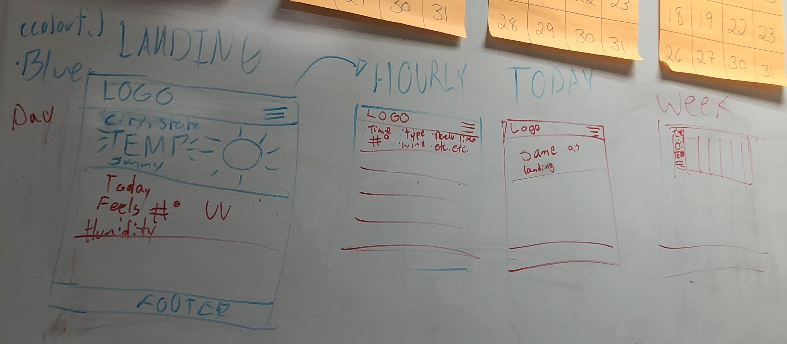

# Weather App

## Discription
> This project will display a user friendly, fully functional weather app satisfactural to all users and devices.
> This Final Project will display the programming skill sets we've learned in the past year in West Mec-Coding 1-2.

### Creators/Credits & OverView

|    Name  |   Task               |
| :----:   | :----:               |
| Alisson  | Bootstrap            |
| Sean     | JS                   |
| Nysa     | Styling              |
| Sam      | README               |

#### Features
> The website will be responsive to all devices
>

#### What will the JS file do?
> The JavaScript will be used to grab the needed information from the JSON file and add it to the HTML in a style that is easy to understand

_________________________________________________________________________

## Mock Up

## To-Do List

### Overview:
1. Map out the landing page, hourly page and weekly page for both mobile and desktop
2. Start html for landing page then move on to hourly and weekly
3. Get content from json file and put it into the HTML
4. Style pages
5. Write README file

### Pages:
#### Landing Page
- start with navbar and footer || AC 5/7
- make logo || NC 5/7
- make nav bar buttons || AC 5/7
- content for the main current weather section (ex: sunny, temp, location , & icon) || SZ 5/13
- content for the other current weather section (ex: humidity, wind, feels like, etc…) || SZ 5/13
- styling & icons || NC 5/17

#### Hourly Page
- divs for every hour || AC 5/12
- div content || SZ 5/17
- style and add icons || NC 5/18

#### Weekly Page
- divs for every day || AC 5/13
- div content || SZ 5/17
- style and add icons || AC 5/18

#### README file || SD 5/ not done

_________________________________________________________________________

## Daliy Log

#### Day 1 5/5
Alisson: started the bootstrap
Sean: started the js & react
Nysa: started styling & found logo
Sam: Absent

#### Day 2: 5/6
Alisson: Continued working on bootstrap
Sean: Fixed the js and worked on json
Nysa: Styling
Sam: Readme.md

#### Day 3: 5/7
Alisson: bootstrap
Sean: Javascript
Nysa: Styling
Sam: Readme.md

#### Day 4: 5/10
Alisson: Finished the Html, started a hourly, and started on weekly.
Sean: Did javascipt, working on the header
Nysa: Styling
Sam: Readme.md

#### Day 6: 5/11
Alisson: Finished the basic Bootstrap
Sean: Put all Javascript information in
Nysa: Finished the navbar
Sam: Readme.md

#### Day 7: 5/12
Alisson: Added png's to the weekly 
Sean: Worked on Javascript
Nysa: Did the today 
Sam: Readme.md

#### Day 8: 5/13
Alisson: Bootstrap
Sean: Javascript
Nysa: Styling
Sam: Readme.md

#### Day 9: 5/14
Alisson: Bootstrap
Sean: Javascript
Nysa: Styling
Sam: Readme.md

#### Day 10: 5/17
Alisson: Fixded the css
Sean: Javascript
Nysa: Styling for Hourly
Sam: Readme.md

#### Day 11: 5/18
Alisson: Bootstrap
Sean: Javascript
Nysa: Styling
Sam: Read.me

#### Day 11: 5/19
Alisson: Bootstrap
Sean: Javascript
Nysa: Styling
Sam: Read.me

#### Day 11: 5/20
Alisson: Added the add
Sean: Fixed the footer and css 
Nysa: Added Todolist and changed formatting of weekly
Sam: Read.me

<<<<<<< HEAD

_______________________________________________________________

=======
_________________________________________________________________________
>>>>>>> d40d5cdcb34b66c4df225944cd74fd57b5a5ed7d
